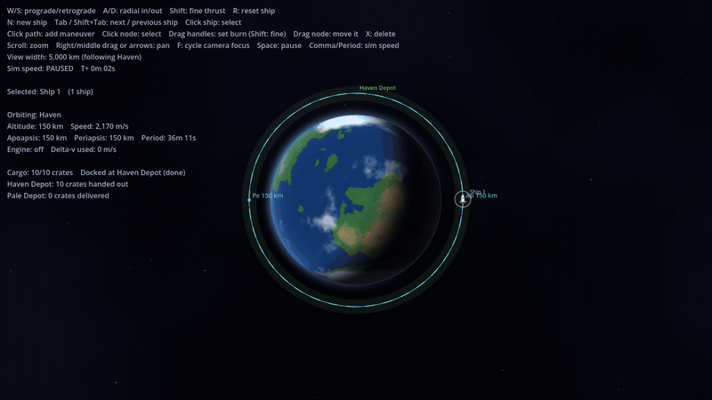

# Astromation

A space logistics prototype in Godot 4.7. Haven and its moon Pale are on rails, and a fleet of ships flies exact Kepler orbits between depot parking orbits. Load crates at Haven Depot, transfer to Pale, and unload them. Plan the trip with chained maneuver nodes, or fly it by hand.

**Play in your browser:** https://gabrielvotaw.github.io/astromation/

## Controls

| Input | Action |
|---|---|
| W / S | Burn prograde / retrograde |
| A / D | Burn radial in / out |
| Shift | Fine thrust (and fine handle dragging) |
| Click the path | Add a maneuver node |
| Click a node | Select it |
| Drag handles / node | Set the burn / move the node along the path |
| X or Delete | Delete the selected node |
| Click a ship, or Tab | Select a ship (Shift+Tab cycles backward) |
| N | Spawn another ship |
| R | Reset the selected ship |
| Space | Pause |
| Comma / Period | Simulation speed |
| Scroll, right-drag, arrows | Zoom and pan |
| F | Cycle camera focus (Haven, selected ship, Pale) |

## Running locally

Open `project.godot` in Godot 4.7 and press F5. Tests: `godot --headless --path . res://tests/run_tests.tscn`.
